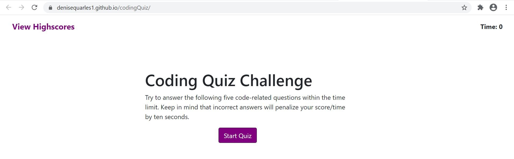

# codingQuiz

## Table of Contents
* [Description](#description)
* [Installation](#installation)
* [Application](#application)
* [Credits](#credits)

## Description
The purpose of this application is to provide a Java Script Quiz to test a user's knowledge as a web developer. The user will click the "Start" Button and the timer will begin. Five questions will be presented and there will be four answer choices. When the user answers a question incorrectly, the ten seconds is subtracted from the clock.
When all questions are answered or the timer reaches 0,the game is over. The user will then be able to save their initials and score.
 
 
  
 
 
## Installation
1. Access my GitHub repository using the following link: https://github.com/denisequarles1/codingQuiz

2. Clone the repo by copying the key.

3. Use GitBash to enter the following: git clone [key]

4. The repository will then be copied onto your computer and you can run the index file to see the Horiseon website.

 

## Application
The deployed application can be found here: https://denisequarles1.github.io/codingQuiz/

 

## Credits
W3Schools: https://www.w3schools.com/

Markup Validation Service: https://validator.w3.org/

